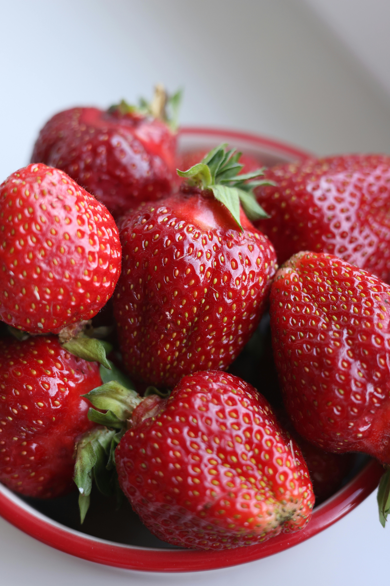
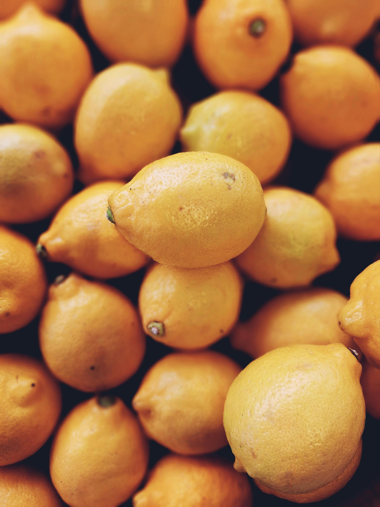
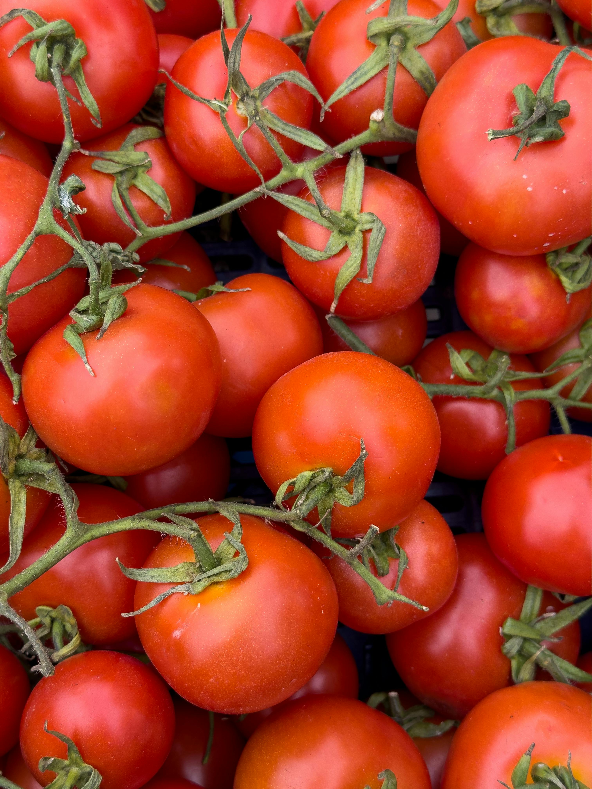
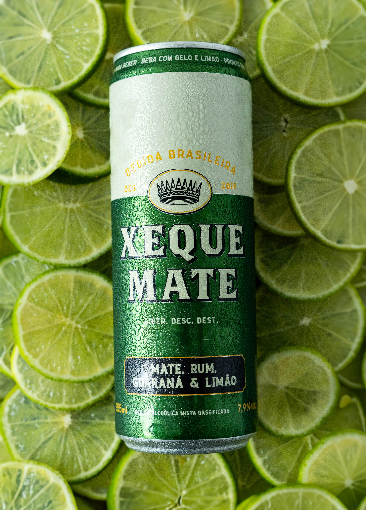
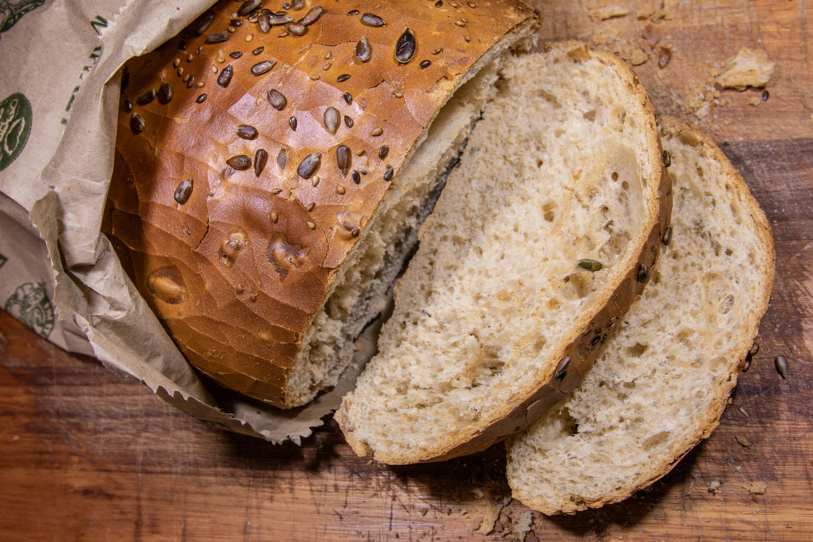

<!DOCTYPE html>
<html lang="en">
    <head>
        <meta charset="UTF-8" />
        <meta name="viewport" content="width=device-width, initial-scale=1.0" />
        <link rel="stylesheet" type="text/css" href="../css/index.css" />
        <link rel="shortcut icon" href="../img/Logo.jpg" />
        <link rel="preconnect" href="https://fonts.googleapis.com" />
        <link rel="preconnect" href="https://fonts.gstatic.com" crossorigin />
        <link
          href="https://fonts.googleapis.com/css2?family=Chewy&family=Montserrat&family=Nunito:wght@300&family=Raleway&display=swap"
          rel="stylesheet"
        />
         
        <title>Productos</title>
      </head>
      <body>
         <!-- Barra de navegación -->
    <nav class="navbar">
        

          
        

        <ul class="nav-list">
          <li><a href="../index.html">Inicio</a></li>
          <li><a href="#productos">Productos</a></li>
          <li><a href="#compra">Compra aquí</a></li>
          <li><a class="carrito-compras">0</a></li>
        </ul>
      </nav>
<body>
    <h2 class="tituloproducto">Productos</h2>
    <!--Productos de tienda-->

    

    

    

    

      

        
        

          
¡Descubre la frescura y el sabor de nuestras fresas!, para quienes buscan calidad y dulzura en cada bocado. Con su vibrante color rojo y su textura jugosa, son ideales para disfrutar solas, en batidos, postres o ensaladas

      

      

        Fresas
        $5.99 la Libra 
      
   
      <button class="CartBtn">
         
          <svg xmlns="http://www.w3.org/2000/svg" height="1.5em" viewBox="0 0 576 512" fill="rgb(17, 17, 17)" class="cart"><path d="M0 24C0 10.7 10.7 0 24 0H69.5c22 0 41.5 12.8 50.6 32h411c26.3 0 45.5 25 38.6 50.4l-41 152.3c-8.5 31.4-37 53.3-69.5 53.3H170.7l5.4 28.5c2.2 11.3 12.1 19.5 23.6 19.5H488c13.3 0 24 10.7 24 24s-10.7 24-24 24H199.7c-34.6 0-64.3-24.6-70.7-58.5L77.4 54.5c-.7-3.8-4-6.5-7.9-6.5H24C10.7 48 0 37.3 0 24zM128 464a48 48 0 1 1 96 0 48 48 0 1 1 -96 0zm336-48a48 48 0 1 1 0 96 48 48 0 1 1 0-96z"></path></svg>
        
        
Agregar

      </button> 
    

  
    

      

        

          
          

            

              ¡Disfruta del sabor fresco y jugoso de nuestras naranjas! Con cada bocado, obtén un toque cítrico revitalizante y una dosis de vitamina C, ideal para un impulso saludable en cualquier momento del día.

        
  
        

          Naranjas
          $5.99 la docena       
        

        <button class="CartBtn">
           
            <svg xmlns="http://www.w3.org/2000/svg" height="1.5em" viewBox="0 0 576 512" fill="rgb(17, 17, 17)" class="cart"><path d="M0 24C0 10.7 10.7 0 24 0H69.5c22 0 41.5 12.8 50.6 32h411c26.3 0 45.5 25 38.6 50.4l-41 152.3c-8.5 31.4-37 53.3-69.5 53.3H170.7l5.4 28.5c2.2 11.3 12.1 19.5 23.6 19.5H488c13.3 0 24 10.7 24 24s-10.7 24-24 24H199.7c-34.6 0-64.3-24.6-70.7-58.5L77.4 54.5c-.7-3.8-4-6.5-7.9-6.5H24C10.7 48 0 37.3 0 24zM128 464a48 48 0 1 1 96 0 48 48 0 1 1 -96 0zm336-48a48 48 0 1 1 0 96 48 48 0 1 1 0-96z"></path></svg>
          
          
Agregar

        </button>
      

    
      

        

          

            
           

            
¡Realza tus platillos con el sabor fresco de nuestros tomates! Cada tomate ofrece un equilibrio perfecto entre dulzura y acidez, ideal para ensaladas, salsas y mucho más. ¡La calidad y frescura que tu cocina merece!

           

          

            Tomates
            $4.99 La libra
          

          <button class="CartBtn">
             
              <svg xmlns="http://www.w3.org/2000/svg" height="1.5em" viewBox="0 0 576 512" fill="rgb(17, 17, 17)" class="cart"><path d="M0 24C0 10.7 10.7 0 24 0H69.5c22 0 41.5 12.8 50.6 32h411c26.3 0 45.5 25 38.6 50.4l-41 152.3c-8.5 31.4-37 53.3-69.5 53.3H170.7l5.4 28.5c2.2 11.3 12.1 19.5 23.6 19.5H488c13.3 0 24 10.7 24 24s-10.7 24-24 24H199.7c-34.6 0-64.3-24.6-70.7-58.5L77.4 54.5c-.7-3.8-4-6.5-7.9-6.5H24C10.7 48 0 37.3 0 24zM128 464a48 48 0 1 1 96 0 48 48 0 1 1 -96 0zm336-48a48 48 0 1 1 0 96 48 48 0 1 1 0-96z"></path></svg>
            
            
Agregar

          </button>
        

    
      

        

           

            
          

            
¡Descubre el sabor auténtico de Brasil con nuestra soda brasileña! Refresca tu paladar con una mezcla única de sabores exóticos y burbujeantes que te transportará directamente a las vibrantes calles de Brasil.

          
  
          

            Soda Brasileña
            $4.99 la unidad
          

          <button class="CartBtn">
             
              <svg xmlns="http://www.w3.org/2000/svg" height="1.5em" viewBox="0 0 576 512" fill="rgb(17, 17, 17)" class="cart"><path d="M0 24C0 10.7 10.7 0 24 0H69.5c22 0 41.5 12.8 50.6 32h411c26.3 0 45.5 25 38.6 50.4l-41 152.3c-8.5 31.4-37 53.3-69.5 53.3H170.7l5.4 28.5c2.2 11.3 12.1 19.5 23.6 19.5H488c13.3 0 24 10.7 24 24s-10.7 24-24 24H199.7c-34.6 0-64.3-24.6-70.7-58.5L77.4 54.5c-.7-3.8-4-6.5-7.9-6.5H24C10.7 48 0 37.3 0 24zM128 464a48 48 0 1 1 96 0 48 48 0 1 1 -96 0zm336-48a48 48 0 1 1 0 96 48 48 0 1 1 0-96z"></path></svg>
            
            
Agregar

          </button>
        

    
      

        

          

            
          

            
¡Disfruta la refrescante burbujeante de Coca-Cola! Cada sorbo ofrece el icónico sabor que todos conocen y aman, perfecto para acompañar cualquier momento del día. ¡El clásico refresco que siempre te hará sonreír!

          
  
          

            Gaseosa Coca Cola
            $12.99 Six Pack
          

          <button class="CartBtn">
             
              <svg xmlns="http://www.w3.org/2000/svg" height="1.5em" viewBox="0 0 576 512" fill="rgb(17, 17, 17)" class="cart"><path d="M0 24C0 10.7 10.7 0 24 0H69.5c22 0 41.5 12.8 50.6 32h411c26.3 0 45.5 25 38.6 50.4l-41 152.3c-8.5 31.4-37 53.3-69.5 53.3H170.7l5.4 28.5c2.2 11.3 12.1 19.5 23.6 19.5H488c13.3 0 24 10.7 24 24s-10.7 24-24 24H199.7c-34.6 0-64.3-24.6-70.7-58.5L77.4 54.5c-.7-3.8-4-6.5-7.9-6.5H24C10.7 48 0 37.3 0 24zM128 464a48 48 0 1 1 96 0 48 48 0 1 1 -96 0zm336-48a48 48 0 1 1 0 96 48 48 0 1 1 0-96z"></path></svg>
            
            
Agregar

          </button>
        
  
    
        

          

            

              
            

              
¡Descubre la elegancia en cada copa con nuestro vino premium! Su riqueza de sabores y aromas refinados realza cualquier ocasión, haciendo de cada brindis un momento especial

            
  
            

              Botella de vino
              $29.99
            

            <button class="CartBtn">
               
                <svg xmlns="http://www.w3.org/2000/svg" height="1.5em" viewBox="0 0 576 512" fill="rgb(17, 17, 17)" class="cart"><path d="M0 24C0 10.7 10.7 0 24 0H69.5c22 0 41.5 12.8 50.6 32h411c26.3 0 45.5 25 38.6 50.4l-41 152.3c-8.5 31.4-37 53.3-69.5 53.3H170.7l5.4 28.5c2.2 11.3 12.1 19.5 23.6 19.5H488c13.3 0 24 10.7 24 24s-10.7 24-24 24H199.7c-34.6 0-64.3-24.6-70.7-58.5L77.4 54.5c-.7-3.8-4-6.5-7.9-6.5H24C10.7 48 0 37.3 0 24zM128 464a48 48 0 1 1 96 0 48 48 0 1 1 -96 0zm336-48a48 48 0 1 1 0 96 48 48 0 1 1 0-96z"></path></svg>
              
              
Agregar

            </button>
          

      
        

          

             

              
              

                
¡Asegura calidad y frescura con nuestra docena de huevos! Ideales para cualquier receta, ofrecen un sabor delicioso y versatilidad en la cocina. ¡El ingrediente esencial para tus platos favoritos!

               
  
            

              Huevos
              $6.99 La docena
            

            <button class="CartBtn">
               
                <svg xmlns="http://www.w3.org/2000/svg" height="1.5em" viewBox="0 0 576 512" fill="rgb(17, 17, 17)" class="cart"><path d="M0 24C0 10.7 10.7 0 24 0H69.5c22 0 41.5 12.8 50.6 32h411c26.3 0 45.5 25 38.6 50.4l-41 152.3c-8.5 31.4-37 53.3-69.5 53.3H170.7l5.4 28.5c2.2 11.3 12.1 19.5 23.6 19.5H488c13.3 0 24 10.7 24 24s-10.7 24-24 24H199.7c-34.6 0-64.3-24.6-70.7-58.5L77.4 54.5c-.7-3.8-4-6.5-7.9-6.5H24C10.7 48 0 37.3 0 24zM128 464a48 48 0 1 1 96 0 48 48 0 1 1 -96 0zm336-48a48 48 0 1 1 0 96 48 48 0 1 1 0-96z"></path></svg>
              
              
Agregar

            </button>
          

    
        

          

            

              
            

              
¡Disfruta la frescura y crocancia de nuestro pan francés! Perfecto para acompañar cualquier comida o disfrutar solo, con una textura ligera y un sabor auténtico. ¡Un clásico que siempre deleita!

            
  
            

              Pan frances
              $4.99 la pieza
            

            <button class="CartBtn">
               
                <svg xmlns="http://www.w3.org/2000/svg" height="1.5em" viewBox="0 0 576 512" fill="rgb(17, 17, 17)" class="cart"><path d="M0 24C0 10.7 10.7 0 24 0H69.5c22 0 41.5 12.8 50.6 32h411c26.3 0 45.5 25 38.6 50.4l-41 152.3c-8.5 31.4-37 53.3-69.5 53.3H170.7l5.4 28.5c2.2 11.3 12.1 19.5 23.6 19.5H488c13.3 0 24 10.7 24 24s-10.7 24-24 24H199.7c-34.6 0-64.3-24.6-70.7-58.5L77.4 54.5c-.7-3.8-4-6.5-7.9-6.5H24C10.7 48 0 37.3 0 24zM128 464a48 48 0 1 1 96 0 48 48 0 1 1 -96 0zm336-48a48 48 0 1 1 0 96 48 48 0 1 1 0-96z"></path></svg>
              
              
Agregar

            </button>
          
  
    
          

            

              

                
              

                
¡Deléitate con el sabor irresistible de nuestro pan con ajo! Perfecto para acompañar tus comidas, combina la crocancia del pan fresco con un toque sabroso y aromático de ajo. ¡Un deleite que realza cada bocado!

              
  
              

                Pan con ajo
                $3.99 la unidad
              

              <button class="CartBtn">
                 
                  <svg xmlns="http://www.w3.org/2000/svg" height="1.5em" viewBox="0 0 576 512" fill="rgb(17, 17, 17)" class="cart"><path d="M0 24C0 10.7 10.7 0 24 0H69.5c22 0 41.5 12.8 50.6 32h411c26.3 0 45.5 25 38.6 50.4l-41 152.3c-8.5 31.4-37 53.3-69.5 53.3H170.7l5.4 28.5c2.2 11.3 12.1 19.5 23.6 19.5H488c13.3 0 24 10.7 24 24s-10.7 24-24 24H199.7c-34.6 0-64.3-24.6-70.7-58.5L77.4 54.5c-.7-3.8-4-6.5-7.9-6.5H24C10.7 48 0 37.3 0 24zM128 464a48 48 0 1 1 96 0 48 48 0 1 1 -96 0zm336-48a48 48 0 1 1 0 96 48 48 0 1 1 0-96z"></path></svg>
                
                
Agregar

              </button>
            

        
          

            

               

                
              

                
¡Disfruta el sabor y la versatilidad de nuestras salchichas! Perfectas para cualquier comida, ofrecen una textura jugosa y un sabor delicioso que realza cada plato. ¡Un clásico que siempre agrada!

              
  
              

                Salchichas
                $9.99 la docena
              

              <button class="CartBtn">
                 
                  <svg xmlns="http://www.w3.org/2000/svg" height="1.5em" viewBox="0 0 576 512" fill="rgb(17, 17, 17)" class="cart"><path d="M0 24C0 10.7 10.7 0 24 0H69.5c22 0 41.5 12.8 50.6 32h411c26.3 0 45.5 25 38.6 50.4l-41 152.3c-8.5 31.4-37 53.3-69.5 53.3H170.7l5.4 28.5c2.2 11.3 12.1 19.5 23.6 19.5H488c13.3 0 24 10.7 24 24s-10.7 24-24 24H199.7c-34.6 0-64.3-24.6-70.7-58.5L77.4 54.5c-.7-3.8-4-6.5-7.9-6.5H24C10.7 48 0 37.3 0 24zM128 464a48 48 0 1 1 96 0 48 48 0 1 1 -96 0zm336-48a48 48 0 1 1 0 96 48 48 0 1 1 0-96z"></path></svg>
                
                
Agregar

              </button>
            

          

            

              

                
              

                
¡Saborea la autenticidad de nuestra baguette fresca! Con su corteza crujiente y miga suave, es el acompañamiento perfecto para cualquier comida o para disfrutar con tus ingredientes favoritos.

              
  
              

                Pan baguet
                $3.99 La unidad
              

              <button class="CartBtn">
                 
                  <svg xmlns="http://www.w3.org/2000/svg" height="1.5em" viewBox="0 0 576 512" fill="rgb(17, 17, 17)" class="cart"><path d="M0 24C0 10.7 10.7 0 24 0H69.5c22 0 41.5 12.8 50.6 32h411c26.3 0 45.5 25 38.6 50.4l-41 152.3c-8.5 31.4-37 53.3-69.5 53.3H170.7l5.4 28.5c2.2 11.3 12.1 19.5 23.6 19.5H488c13.3 0 24 10.7 24 24s-10.7 24-24 24H199.7c-34.6 0-64.3-24.6-70.7-58.5L77.4 54.5c-.7-3.8-4-6.5-7.9-6.5H24C10.7 48 0 37.3 0 24zM128 464a48 48 0 1 1 96 0 48 48 0 1 1 -96 0zm336-48a48 48 0 1 1 0 96 48 48 0 1 1 0-96z"></path></svg>
                
                
Agregar

              </button>
            

    

    
 
</body>
</html>